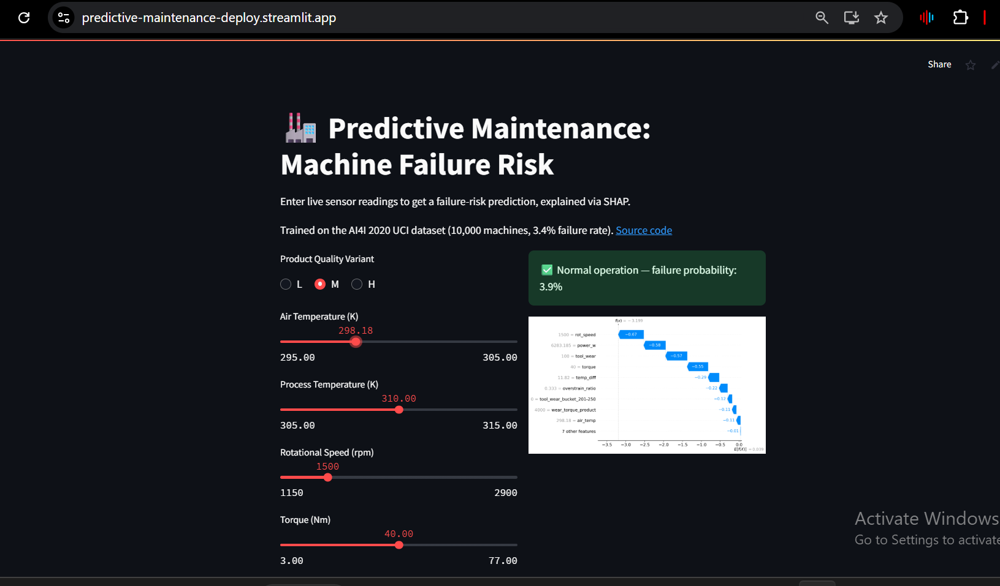
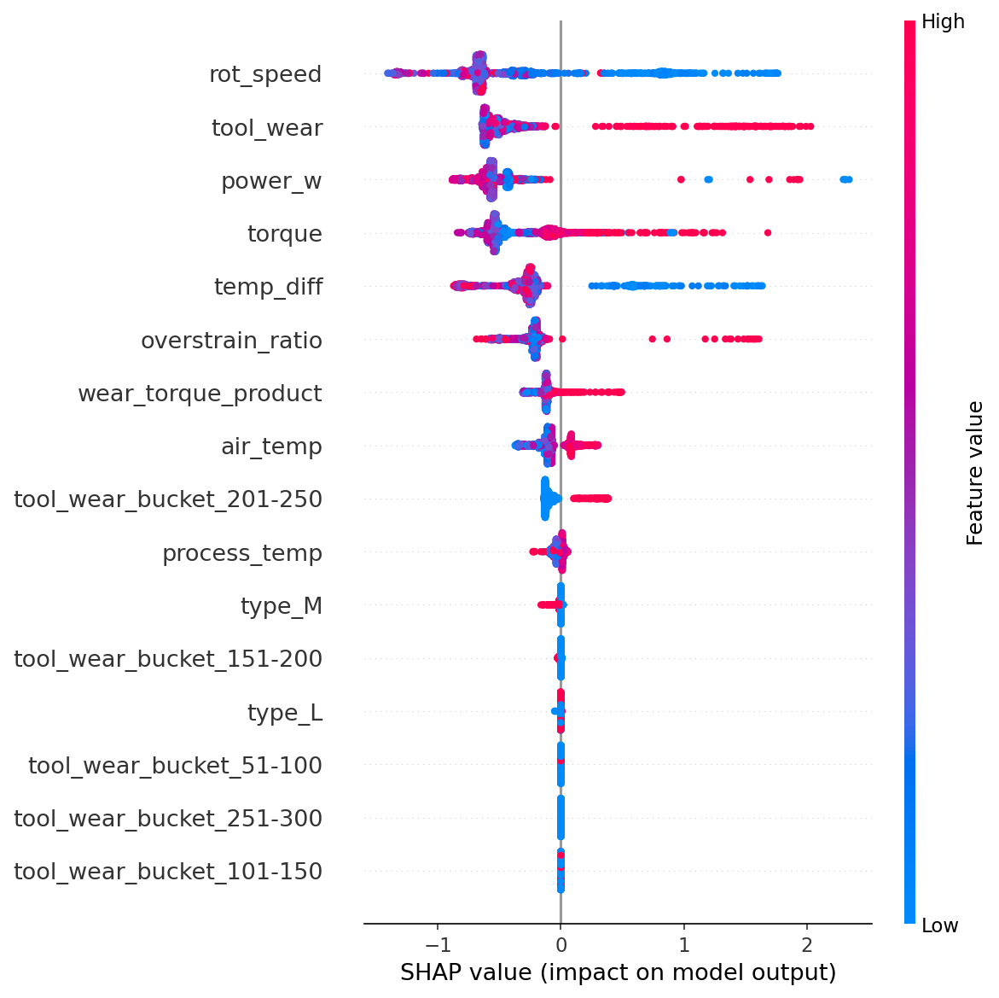

# 🏭 Predictive Maintenance: Machine Failure Prediction

[](https://predictive-maintenance-deploy.streamlit.app/)
[]()
[]()

**Live demo:** [predictive-maintenance-deploy.streamlit.app](https://predictive-maintenance-deploy.streamlit.app/)
*(free-tier hosting — may take ~30s to wake up if it's been idle)*

Predicts machine failure risk from live sensor readings using a tuned XGBoost
classifier, with SHAP explanations showing exactly which readings drive each
prediction — trained on the AI4I 2020 industrial dataset (10,000 machines,
3.39% failure rate).



## The problem

Unplanned machine failure is expensive, and a single threshold rule doesn't
capture it well: this dataset's failures come from several distinct physical
mechanisms (heat dissipation, overstrain, power draw) that interact in ways a
simple rule-based system misses but a model can learn. The harder problem
underneath all of it is that failures are rare — only 3.39% of machines fail
— so "accuracy" is a meaningless metric here, and most of the real work in
this project is about handling that imbalance honestly.

## Results

| Model | PR-AUC | Recall | Precision | False Positives (of 2,000 test rows) |
|---|---|---|---|---|
| Baseline (Logistic Regression) | 0.446 | 91.2% | 20.4% | 242 |
| **Tuned XGBoost** | **0.893** | **89.7%** | **47.3%** | **68** |

The tuned model catches ~90% of real failures while cutting false alarms by
72% compared to the baseline — the difference between a system a maintenance
team would actually trust and one they'd learn to tune out.

## Why this dataset (and why it's harder than it looks)

- **Severe imbalance.** At 3.39% positive rate, a model that always predicts
  "no failure" scores 96.6% accuracy while catching zero real failures —
  every metric and modeling choice below exists because of this.
- **Real physical thresholds, not just correlation.** Overstrain failure
  triggers when `tool_wear × torque` crosses a threshold that differs by
  product variant (11,000 / 12,000 / 13,000 for L/M/H parts); heat
  dissipation failure depends on the exact gap between process and air
  temperature. Good feature engineering here means deriving the actual
  quantities these rules depend on, not hoping the model reconstructs them
  from raw sensors.
- **Rarely used as a portfolio dataset** compared to churn/Titanic/credit
  default, which also meant no shortcuts — no existing writeups to lean on
  for what "good" looks like on this data.

## What I built

1. **EDA** — quantified the imbalance, confirmed the 5 individual
   failure-mode columns (TWF/HDF/PWF/OSF/RNF) are leakage and must be
   dropped before training, since they directly determine the target
   ([notebook](notebooks/01_eda_and_modeling.ipynb))
2. **Feature engineering** — derived `temp_diff`, `power_w`, and a
   type-adjusted `overstrain_ratio` directly from the dataset's known
   failure-generating rules, rather than relying on the model to
   rediscover them from raw sensors alone (`src/data_prep.py`)
3. **Modeling** — Logistic Regression baseline, then XGBoost tuned via
   `RandomizedSearchCV` (40 candidates × 5-fold stratified CV, optimizing
   PR-AUC, the correct metric for a rare-positive problem) with
   `scale_pos_weight` to handle the imbalance directly in the loss function
   rather than resampling (`src/train.py`)
4. **Explainability** — SHAP `TreeExplainer` for global feature importance
   and per-prediction waterfall plots, so every prediction comes with a
   reason, not just a number (`src/explain.py`)
5. **Deployment** — interactive Streamlit app serving live predictions with
   a live, per-request SHAP explanation (`deploy/app.py`)

## Key finding



Two of the three engineered features — `power_w` and `temp_diff` — rank
above several raw sensors in the global SHAP summary, direct evidence that
deriving the physical quantities behind the failure rules added real signal
rather than just decorating the feature set. `overstrain_ratio` and
`wear_torque_product` rank lower than expected going in, which is worth
stating plainly rather than glossing over: it suggests XGBoost was already
finding much of the `tool_wear`×`torque` interaction on its own from the raw
columns, and the explicit engineered ratio added a smaller, though still
non-zero, marginal signal on top.

## Tech stack

Python · pandas · scikit-learn · XGBoost · SHAP · Streamlit

## Known limitations

- `deploy/data_prep.py` duplicates feature-engineering logic from
  `src/data_prep.py`, because Streamlit Community Cloud requires a flat,
  self-contained repo rather than a shared installable package. This is a
  real train/serve-skew risk if one copy is edited without the other — the
  honest fix in a more mature version of this project would be a small
  installable package imported by both training and serving code.
- Decision threshold is fixed at 0.5. A real deployment would tune this
  against the actual cost ratio of a missed failure versus a false alarm,
  which depends on information (cost of downtime, cost of a maintenance
  callout) this dataset doesn't provide.
- Deployed on Streamlit Community Cloud rather than Hugging Face Spaces,
  after HF changed policy to require a paid plan for Gradio/Docker Spaces
  mid-project — the original app was built and tested in Gradio locally
  (see `app/app.py`) before being adapted to Streamlit for free hosting
  (see `deploy/app.py`).

## Run it locally

```bash
git clone https://github.com/YOUR_USERNAME/predictive-maintenance-ml
cd predictive-maintenance-ml
pip install -r requirements.txt

# Train and explain
python -m src.train
python -m src.explain

# Run the local Gradio version
python -m app.app

# Or run the deployed Streamlit version
streamlit run deploy/app.py
```

## Project structure

```
predictive-maintenance-ml/
├── README.md
├── requirements.txt
├── data/raw/                  # cached dataset
├── notebooks/01_eda.ipynb     # EDA and feature validation
├── src/
│   ├── data_prep.py           # loading + feature engineering
│   ├── pipeline.py            # preprocessing + train/test split
│   ├── train.py                # baseline + tuned XGBoost training
│   └── explain.py              # SHAP analysis
├── models/xgb_churn_model.pkl # trained pipeline
├── app/app.py                  # local Gradio demo
├── deploy/                     # Streamlit Cloud deployment bundle
└── assets/                     # plots + screenshots for this README
```


## Testing

Feature engineering is covered by unit tests, including a check that the
same `tool_wear`/`torque` values produce a *different* `overstrain_ratio`
depending on product type — the entire reason that feature exists.

\`\`\`bash
pip install pytest
pytest tests/
\`\`\`

## Roadmap / what I'd do next

- Tune the decision threshold against an actual cost ratio (missed failure
  vs. false alarm) instead of the default 0.5
- Resolve the `src/`↔`deploy/` feature-engineering duplication with a small
  installable package shared by both training and serving code
- Extend to multi-label prediction across the five individual failure modes
  (TWF/HDF/PWF/OSF/RNF), not just the combined binary target
- Add model monitoring for feature drift if this were ever fed live sensor
  data instead of static historical records

## Acknowledgments

Dataset: S. Matzka, "Explainable Artificial Intelligence for Predictive
Maintenance Applications," 2020, hosted at the
[UCI Machine Learning Repository](https://archive.ics.uci.edu/dataset/601/ai4i+2020+predictive+maintenance+dataset).


## 👤 Author

**Ameer Hamza**  
[LinkedIn](https://www.linkedin.com/in/ameer-hamza-8990953bb) • [GitHub](https://github.com/ameerhamza18) 